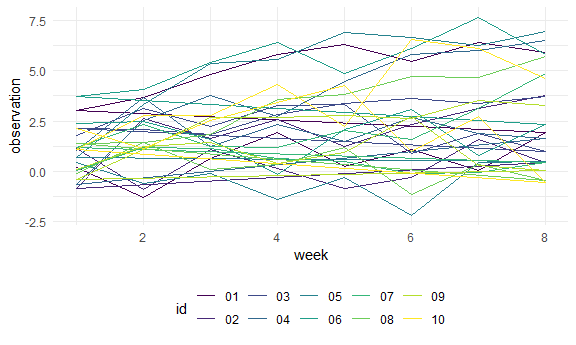
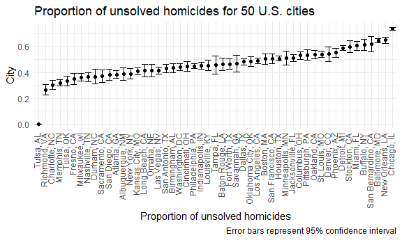
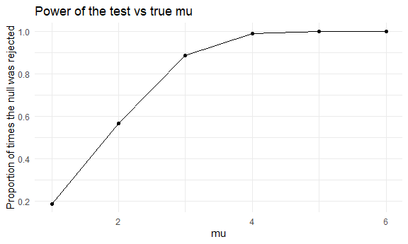
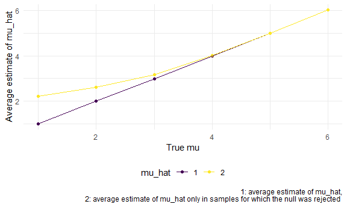

p8105_hw5_js6177
================
Jiayi Shi
2022-11-03

## Problem 1

``` r
path = "data/data"

study_df = 
  tibble(
    file_name = list.files(path)
  ) %>% 
  mutate(
    obs = map(str_c(path, "/", file_name), read_csv),
    file_name = tools::file_path_sans_ext(file_name)
    ) %>% 
  unnest(obs) %>% 
  separate(file_name, into = c("arm","id"), sep = "_") %>% 
  pivot_longer(
    week_1:week_8,
    names_to = "week",
    names_prefix = "week_",
    values_to = "observation"
  ) %>% 
  mutate(
    week = as.integer(week)
  ) %>% 
  select(arm, id, week, observation)
```

plot:

``` r
study_df %>% 
  ggplot(aes(x = week, y = observation, color = id))+
  geom_path()
```



numeric analysis

``` r
study_df %>% 
  group_by(arm) %>% 
  summarise(
    obs_mean = mean(observation),
    obs_sd = sd(observation),
    obs_max = max(observation),
    obs_min = min(observation)
  )
```

    ## # A tibble: 2 × 5
    ##   arm   obs_mean obs_sd obs_max obs_min
    ##   <chr>    <dbl>  <dbl>   <dbl>   <dbl>
    ## 1 con       1.02   1.29    4.26   -2.17
    ## 2 exp       3.64   1.96    7.66   -0.84

## Problem 2

Read raw data:

``` r
homicide_data = read_csv("data/homicide-data.csv")
```

The raw data set has 52179 homicides in 50 large US cities from 2007 to
2017. It contains 12 variables, including the id of the killing, the
reported date, the basic demographic information about each victim
(first name, last name, race, age and sex), the location of the killing
(city, state, latitude and longitude) and whether an arrest was made.

The code below createa a `city_state` variable and summarizes within
cities to obtain the total number of homicides and the number of
unsolved homicides. The result is solved in `table`.

``` r
homicide_data =
  mutate(homicide_data, city_state = str_c(city, state, sep = ", "))

table = homicide_data %>% 
  group_by(city_state) %>% 
  summarise(
    total = n(),
    unsolved = sum(disposition %in% c("Closed without arrest","Open/No arrest"))
    )

table %>% knitr::kable()
```

| city_state         | total | unsolved |
|:-------------------|------:|---------:|
| Albuquerque, NM    |   378 |      146 |
| Atlanta, GA        |   973 |      373 |
| Baltimore, MD      |  2827 |     1825 |
| Baton Rouge, LA    |   424 |      196 |
| Birmingham, AL     |   800 |      347 |
| Boston, MA         |   614 |      310 |
| Buffalo, NY        |   521 |      319 |
| Charlotte, NC      |   687 |      206 |
| Chicago, IL        |  5535 |     4073 |
| Cincinnati, OH     |   694 |      309 |
| Columbus, OH       |  1084 |      575 |
| Dallas, TX         |  1567 |      754 |
| Denver, CO         |   312 |      169 |
| Detroit, MI        |  2519 |     1482 |
| Durham, NC         |   276 |      101 |
| Fort Worth, TX     |   549 |      255 |
| Fresno, CA         |   487 |      169 |
| Houston, TX        |  2942 |     1493 |
| Indianapolis, IN   |  1322 |      594 |
| Jacksonville, FL   |  1168 |      597 |
| Kansas City, MO    |  1190 |      486 |
| Las Vegas, NV      |  1381 |      572 |
| Long Beach, CA     |   378 |      156 |
| Los Angeles, CA    |  2257 |     1106 |
| Louisville, KY     |   576 |      261 |
| Memphis, TN        |  1514 |      483 |
| Miami, FL          |   744 |      450 |
| Milwaukee, wI      |  1115 |      403 |
| Minneapolis, MN    |   366 |      187 |
| Nashville, TN      |   767 |      278 |
| New Orleans, LA    |  1434 |      930 |
| New York, NY       |   627 |      243 |
| Oakland, CA        |   947 |      508 |
| Oklahoma City, OK  |   672 |      326 |
| Omaha, NE          |   409 |      169 |
| Philadelphia, PA   |  3037 |     1360 |
| Phoenix, AZ        |   914 |      504 |
| Pittsburgh, PA     |   631 |      337 |
| Richmond, VA       |   429 |      113 |
| Sacramento, CA     |   376 |      139 |
| San Antonio, TX    |   833 |      357 |
| San Bernardino, CA |   275 |      170 |
| San Diego, CA      |   461 |      175 |
| San Francisco, CA  |   663 |      336 |
| Savannah, GA       |   246 |      115 |
| St. Louis, MO      |  1677 |      905 |
| Stockton, CA       |   444 |      266 |
| Tampa, FL          |   208 |       95 |
| Tulsa, AL          |     1 |        0 |
| Tulsa, OK          |   583 |      193 |
| Washington, DC     |  1345 |      589 |

``` r
unsolved = table %>% 
  filter(city_state == "Baltimore, MD") %>% 
  pull(unsolved)

total = table %>% 
  filter(city_state == "Baltimore, MD") %>%
  pull(total)

prop = prop.test(unsolved, total)
```

- estimated proportion:

``` r
broom::tidy(prop) %>% pull(estimate) %>% round(3)
```

    ##     p 
    ## 0.646

- confidence interval:

``` r
lower_bound = broom::tidy(prop) %>% pull(conf.low) %>% round(3)
upper_bound = broom::tidy(prop) %>% pull(conf.high) %>% round(3)

str_c(lower_bound, upper_bound, sep = ",")
```

    ## [1] "0.628,0.663"

I define a function `prop_ci` to derive the estimated proportion and
confidence intervals with input.

``` r
prop_ci = function(data){
  
  prop = prop.test(data$unsolved, data$total)
  
  broom::tidy(prop) %>% 
    select(estimate, conf.low, conf.high)
}
```

I use list columns to get estimated proportions and CIs for each city. I
first nest the `total` and `unsolved` columns in `table` and then map it
to the function I defined above.

``` r
prop_df =
  nest(table, data = total:unsolved) %>% 
  mutate(unsolved_data = map(.$data, prop_ci)) %>%
  unnest(unsolved_data) %>% 
  select(-data) %>% 
  rename(conf_low = conf.low, conf_high = conf.high)
```

    ## Warning in prop.test(data$unsolved, data$total): Chi-squared approximation may
    ## be incorrect

The code below create a plot that shows the estimates and CIs for each
city.

``` r
prop_df %>% 
  # Organize cities according to the proportion of unsolved homicide.
  mutate(city_state = fct_reorder(city_state, estimate)) %>% 
  
  ggplot(aes(x = city_state, y = estimate))+
  geom_point()+
  geom_errorbar(aes(ymin = conf_low, ymax = conf_high))+
  coord_flip()+
  labs(title = "Proportion of unsolved homicides for 50 U.S. cities", 
       x = "Proportion of unsolved homicides", 
       y = "City", 
       caption = "Error bars represent 95% confidence interval")
```



## Problem 3

I write a function `sim_mu_p` to generate a dataset which follows a
normal distribution with mean equals 0 and standard deviation equals 5,
and then obtain the estimated mu and p-value by performing a t test at
0.05 significance level.

``` r
n = 30
sigma = 5
mu = 0

sim_mu_p = function(mu){
  
  sim_data = tibble(x = rnorm(n, mu, sigma))
  
  sim_data %>% 
  t.test(mu = 0, conf.level = 0.95) %>% 
  broom::tidy() %>% 
  select(estimate, p.value)
}
```

Generate 5000 datasets and apply the function defined above.

``` r
output = vector("list", 5000)

for (i in 1:5000){
  output[[i]] = sim_mu_p(mu)
}

sim_results = bind_rows(output) 
```

The code below repeats the above for μ={1,2,3,4,5,6}.

``` r
sim_df = 
  expand_grid(
    n = 30,
    sigma = 5,
    mu = c(1,2,3,4,5,6),
    iter = 1:5000
  ) %>% 
  mutate(result = map(mu, sim_mu_p)) %>% 
  unnest(result)
```

I then make a plot showing the proportion of times the null was rejected
(the power of the test) vs the true value of $\mu$.

``` r
sim_df %>%  
  group_by(mu) %>% 
  summarise(
    total = n(),
    n_reject = sum(p.value<0.05),
    prop = n_reject/total
  ) %>% 
  ggplot(aes(x = mu, y = prop))+
  geom_point()+
  geom_path()+
  labs(
    title = "Power of the test vs true mu",
    x = "mu",
    y = "Proportion of times the null was rejected"
  )
```



From the plot, we can see that when the effect size increases, the power
increases, but the increasing rate get smaller and tends to 0.

The plot below shows the average estimate of $\hat{\mu}$ and the average
estimate of $\hat{\mu}$ only in samples for which the null was rejected
vs the true $\mu$

``` r
sim_df %>% 
  group_by(mu) %>% 
  summarise(
    avg_mu_hat_1 = mean(estimate)
  ) %>% left_join(
    sim_df %>% 
      filter(p.value<0.05) %>% 
      group_by(mu) %>% 
      summarise(
        avg_mu_hat_2 = mean(estimate)
  ), by = "mu"
  ) %>% 
  pivot_longer(
    2:3,
    names_to = "mu_hat",
    names_prefix = "avg_mu_hat_",
    values_to = "avg_estimate"
  ) %>% 
  ggplot(aes(y = avg_estimate, x = mu, color = mu_hat)) +
  geom_point()+
  geom_path()+
  labs(
    x = "True mu",
    y = "Average estimate of mu_hat"
  )
```



The sample average of $\hat{\mu}$ across tests for which the null is
rejected approximately equal to the true value of $\mu$ only when effect
size/power of the test is large.
